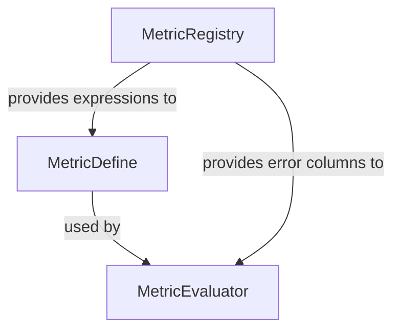

# CLAUDE.md - Development Guidelines for `polars-eval-metrics` Package

This document provides comprehensive guidance for developing and maintaining the `polars-eval-metrics` package, a high-performance model evaluation framework using Polars lazy evaluation.

## Project Overview

**Package Name**: `polars-eval-metrics`  
**Purpose**: A flexible, high-performance framework for evaluating model predictions with support for hierarchical aggregations, custom metrics, and YAML-based configuration.

### Key Features
- **Lazy Evaluation**: Leverages Polars LazyFrame for optimal query planning
- **Flexible Metrics**: Built-in and custom metric definitions
- **YAML Configuration**: Complete evaluation setup via YAML
- **Type Safety**: Pydantic validation throughout
- **Hierarchical Aggregation**: Support for subject/visit level metrics
- **Clear Architecture**: Separation of definition, creation, and evaluation

## Project Structure

```
demo_eval_metric/
+-- plan/                        # [REFERENCE ONLY - DO NOT MODIFY]
|   +-- CLAUDE.md               # Original planning documentation
|   +-- class_diagram.md        # Architecture diagrams
|   +-- polar_expression.md     # Polars expression patterns
|   +-- YAML_PATTERNS.md        # YAML configuration patterns
|   +-- examples.qmd            # Example notebooks
|   +-- evaluation_schema.yaml  # Schema reference
|
+-- src/                         # [PRODUCTION CODE]
|   +-- polars_eval_metrics/
|       +-- __init__.py         # Package exports
|       +-- metric_define.py    # MetricDefine class - metric definition
|       +-- metric_registry.py  # Unified registry for all expressions
|       +-- metric_helpers.py   # Helper functions for creating metrics
|       +-- metric_evaluator.py # MetricEvaluator - executes evaluations
|       +-- py.typed            # PEP 561 type hint marker
|
+-- docs/                        # [DOCUMENTATION WEBSITE]
|   +-- _quarto.yml             # Quarto configuration
|   +-- index.qmd               # Homepage
|   +-- quickstart.qmd         # Quick start guide
|   +-- metric.qmd              # MetricDefine examples
|   +-- _site/                  # [GENERATED - git ignored]
|
+-- tests/                       # [TEST SUITE]
|   +-- test_metric_define.py  # Unit tests for MetricDefine
|   +-- test_basic.py.bak       # [BACKUP - to be updated]
|
+-- .github/
|   +-- workflows/
|       +-- docs.yml            # Documentation deployment
|       +-- test.yml            # CI/CD testing pipeline
|
+-- pyproject.toml              # Package configuration
+-- README.md                   # Project README
+-- LICENSE                     # MIT License
+-- CLAUDE.md                   # This file
```

## Core Architecture

### Class Hierarchy and Responsibilities



### 1. **MetricRegistry** (`metric_registry.py`)
**Purpose**: Unified registry for all expression types  
**Responsibilities**:
- Manage error expressions (data preparation)
- Manage metric expressions (aggregation)
- Manage selector expressions (second-level aggregation)
- Provide consistent API for registration and retrieval

**Key Features**:
```python
# Error expressions
MetricRegistry.register_error(name, func)
MetricRegistry.get_error(name, estimate, ground_truth, **params)
MetricRegistry.generate_error_columns(estimate, ground_truth, error_types)

# Metric expressions
MetricRegistry.register_metric(name, expr)
MetricRegistry.get_metric(name)

# Selector expressions
MetricRegistry.register_selector(name, expr)
MetricRegistry.get_selector(name)
```

### 2. **MetricDefine** (`metric_define.py`)
**Purpose**: Core metric definition class  
**Responsibilities**:
- Define metric properties (name, label, type, scope)
- Hold within-entity and across-entity aggregation expressions
- Validate metric configuration
- Resolve expressions from MetricRegistry

**Key Features**:
```python
class MetricDefine:
    name: str                           # Metric identifier
    label: str | None                   # Display name
    type: MetricType                    # Aggregation type
    scope: MetricScope | None           # Calculation scope
    within_expr: list[str | pl.Expr]   # Within-entity aggregation expressions
    across_expr: str | pl.Expr         # Across-entity aggregation expression
```

**Expression Naming Convention** (Updated 2025-01-03):
- `within_expr`: Expressions for within-entity aggregation (e.g., within subject/visit)
  - Used in WITHIN_SUBJECT, ACROSS_SUBJECT, WITHIN_VISIT, ACROSS_VISIT
  - Aggregates data within each entity (subject or visit)
- `across_expr`: Expressions for across-entity aggregation or final computation
  - For ACROSS_SAMPLES: Applied directly to error columns
  - For ACROSS_SUBJECT/VISIT: Summarizes within_expr results across entities
  - For WITHIN_SUBJECT/VISIT: Not used (within_expr provides final result)

Note: These are distinct from `group_by`/`subgroup_by` which control analysis stratification (e.g., by treatment, age, sex)

### 3. **MetricEvaluator** (`metric_evaluator.py`)
**Purpose**: Main evaluation engine  
**Responsibilities**:
- Execute metric evaluations on data
- Generate error columns using MetricRegistry
- Handle hierarchical aggregations
- Apply filters and grouping
- Return results as Polars DataFrames

## Metric Types and Aggregation Patterns

### MetricType Enum
| Type | Description | LazyFrame Pattern |
|------|-------------|-------------------|
| `ACROSS_SAMPLES` | Aggregate across all samples | `.select(expr)` |
| `WITHIN_SUBJECT` | Aggregate within each subject | `.group_by('subject_id').agg(expr)` |
| `ACROSS_SUBJECT` | Two-level: within then across subjects | `.group_by('subject_id').agg(expr).select(selector)` |
| `WITHIN_VISIT` | Aggregate within each visit | `.group_by(['subject_id', 'visit_id']).agg(expr)` |
| `ACROSS_VISIT` | Two-level: within then across visits | `.group_by(['subject_id', 'visit_id']).agg(expr).select(selector)` |

### MetricScope Enum
| Scope | Description | Usage |
|-------|-------------|-------|
| `GLOBAL` | Calculate once for entire dataset | Overall metrics |
| `MODEL` | Calculate per model only | Model comparison |
| `GROUP` | Calculate per group only | Group analysis |

## Development Workflow

### 1. Setting Up Development Environment
```bash
# Create virtual environment
uv venv
source .venv/bin/activate  # On Windows: .venv\Scripts\activate

# Install package in development mode
uv pip install -e .

# Install test dependencies
uv pip install pytest pytest-cov
```

### 2. Running Tests
```bash
# Run all tests
python -m pytest tests/ -v

# Run specific test file
python -m pytest tests/test_metric_define.py -v

# Run with coverage
python -m pytest tests/ --cov=src/polars_eval_metrics --cov-report=html
```

### 3. Code Quality Checks
```bash
# Format code
black src/ tests/

# Lint code
ruff check src/ tests/

# Type checking (if configured)
mypy src/polars_eval_metrics
```

### 4. Documentation
```bash
# Build documentation locally
cd docs
quarto render

# Preview documentation
quarto preview
```

## API Usage Examples

### Using the Unified MetricRegistry
```python
from polars_eval_metrics import MetricRegistry
import polars as pl

# Register custom error type
MetricRegistry.register_error('within_threshold', 
    lambda est, gt, threshold=1.0: (pl.col(est) - pl.col(gt)).abs() <= threshold)

# Register custom metric using the error type
MetricRegistry.register_metric('accuracy',
    pl.col('within_threshold').mean() * 100)

# Register custom selector
MetricRegistry.register_selector('p90', pl.col('value').quantile(0.9))

# List available expressions
print(MetricRegistry.list_errors())    # All error types
print(MetricRegistry.list_metrics())   # All metrics
print(MetricRegistry.list_selectors()) # All selectors
```

### Basic Metric Definition
```python
from polars_eval_metrics import MetricDefine, MetricType

# Simple metric using built-in expression
mae = MetricDefine(name="mae")

# Custom metric with inline expression
pct_accurate = MetricDefine(
    name="pct_within_1",
    label="% Within +/- 1",
    type=MetricType.ACROSS_SAMPLES,
    across_expr=(pl.col('absolute_error') < 1).mean() * 100
)
```

### Hierarchical Metrics
```python
# Two-level aggregation
mae_mean = MetricDefine(
    name="mae:mean",
    type=MetricType.ACROSS_SUBJECT
)
```

### YAML Configuration
```yaml
# evaluation_config.yaml
ground_truth: actual
estimates: [model_1, model_2]
group_by: [treatment_group]

metrics:
  - name: mae
    label: Mean Absolute Error
    
  - name: rmse:median
    label: Median RMSE by Subject
    type: across_subject
```

### Creating Metrics from Configuration
```python
from polars_eval_metrics import MetricDefine, MetricType, create_metrics

# Direct metric creation
metric = MetricDefine(
    name='mae',
    type=MetricType.ACROSS_SAMPLES
)

# Create multiple metrics from list
metrics = create_metrics(['mae', 'rmse', 'me'])

# Create from configuration dictionaries
configs = [
    {'name': 'mae', 'label': 'Mean Absolute Error'},
    {'name': 'rmse', 'type': 'across_subject'}
]
metrics = create_metrics(configs)
```

## Testing Strategy

### Current Test Coverage
- [x] **test_metric_define.py**: Comprehensive tests for MetricDefine
  - Basic metric creation
  - Custom expressions
  - Validation rules
  - All metric types and scopes

### Needed Tests
- [ ] MetricEvaluator integration tests
- [ ] End-to-end workflow tests

## GitHub Actions CI/CD

### Test Workflow (`.github/workflows/test.yml`)
- Runs on: Push to main, Pull requests
- Python versions: 3.11, 3.12
- Steps:
  1. Install dependencies
  2. Run pytest
  3. Check code formatting
  4. Run linting

### Documentation Workflow (`.github/workflows/docs.yml`)
- Runs on: Push to main
- Deploys to: GitHub Pages
- Process:
  1. Build Quarto documentation
  2. Deploy to gh-pages branch

## Important Development Notes

### DO's
1. **Use Type Hints**: All functions should have type annotations
2. **Write Tests First**: TDD approach for new features
3. **Direct Creation**: Create MetricDefine instances directly or via EvaluationConfig
4. **Validate Early**: Use Pydantic validation in MetricDefine
5. **Document Examples**: Add examples to docs/ for new features
6. **Use ASCII Only**: All code, documentation, and comments must use ASCII characters only
7  **Using typing consistently** using |, dict etc

### DON'Ts
1. **Don't Modify plan/**: Reference only, contains original design
2. **Don't Skip Validation**: Always validate user input
3. **Don't Mix Concerns**: Keep metric definition separate from evaluation
4. **Don't Hardcode**: Use configuration for all settings
5. **Don't Use Unicode**: No emojis, special symbols, or non-ASCII characters

## Common Patterns

### Registering Custom Expressions
```python
# Create a registry instance
registry = MetricRegistry()

# Register custom error type with parameters
def buffer_error(estimate: str, ground_truth: str, buffer: float = 0.5):
    return (pl.col(estimate) - pl.col(ground_truth)).abs() <= buffer

registry.register_error('buffer_error', buffer_error)

# Register metric that uses the custom error
registry.register_metric('buffer_accuracy',
    pl.col('buffer_error').mean() * 100)

# Use in evaluation
evaluator = MetricEvaluator(
    df=data,
    metrics=[MetricDefine(name='buffer_accuracy')],
    registry=registry,  # Pass the custom registry
    # ... other parameters
)
```

### Creating Custom Metrics
```python
# Pattern 1: Simple custom expression
metric = MetricDefine(
    name="custom",
    across_expr=pl.col("error").abs().mean()
)

# Pattern 2: Using registered metric with custom selector
metric = MetricDefine(
    name="mae_p90",
    type=MetricType.ACROSS_SUBJECT,
    within_expr="mae",  # From registry
    across_expr=pl.col("value").quantile(0.9)  # Custom
)

# Pattern 3: Multiple aggregations
metric = MetricDefine(
    name="weighted",
    type=MetricType.ACROSS_SUBJECT,
    within_expr=["mae", pl.col("weight").mean().alias("w")],
    across_expr=(pl.col("value") * pl.col("w")).sum() / pl.col("w").sum()
)
```

## Troubleshooting

### Issue: Import errors in tests
**Solution**: Install package in development mode
```bash
uv pip install -e .
```

### Issue: GitHub Actions failing
**Solution**: Check test.yml points to correct directories:
- Tests should run from root: `pytest tests/`
- Coverage should check: `src/polars_eval_metrics`

### Issue: Documentation not building
**Solution**: Ensure all imports in docs use correct paths:
```python
import sys
sys.path.append('../src')
from polars_eval_metrics import MetricDefine
```

## Future Enhancements

### Planned Features
1. **pl_expr() method**: Show LazyFrame chain visualization
2. **More built-in expressions**: Expand the registry with more error types, metrics, and selectors
3. **Performance benchmarks**: Add performance testing suite
4. **CLI interface**: Command-line evaluation tool
5. **Expression composition**: Build complex metrics from simpler ones

### Completed Features
- ✅ **Unified Registry Pattern**: All expressions (errors, metrics, selectors) in MetricRegistry
- ✅ **Custom Expression Support**: Easy registration of custom expressions
- ✅ **Clean Architecture**: Separation of concerns between definition and evaluation

### Built-in Expressions

#### Error Types
- `error`: Basic difference (estimate - ground_truth)
- `absolute_error`: Absolute difference
- `squared_error`: Squared difference
- `percent_error`: Percentage error
- `absolute_percent_error`: Absolute percentage error

#### Metrics
- `mae`: Mean Absolute Error
- `mse`: Mean Squared Error
- `rmse`: Root Mean Squared Error
- `me`: Mean Error (bias)
- `mpe`: Mean Percentage Error
- `mape`: Mean Absolute Percentage Error
- `n_subject`: Number of unique subjects
- `n_visit`: Number of unique visits
- `n_sample`: Sample count

#### Selectors (Aggregation Functions)
- Basic statistics: `mean`, `median`, `std`, `min`, `max`, `sum`, `sqrt`
- Percentiles: `p1`, `p5`, `p25`, `p75`, `p90`, `p95`, `p99`

## Contributing Guidelines

### Pull Request Process
1. Create feature branch from main
2. Write tests for new features
3. Update documentation
4. Ensure all tests pass
5. Update CHANGELOG.md
6. Submit PR with clear description

### Code Review Checklist
- [ ] Tests added/updated
- [ ] Documentation updated
- [ ] Type hints present
- [ ] No breaking changes
- [ ] Follows existing patterns

## Support and Resources

- **Documentation**: Auto-deployed to GitHub Pages
- **Issues**: GitHub Issues for bug reports
- **Discussions**: GitHub Discussions for questions
- **Examples**: See `docs/` directory for usage examples

---

*Last updated: 2025-01-02*  
*Maintainer: Engineering Team*  
*Major Update: Unified MetricRegistry system - all expressions in one place*