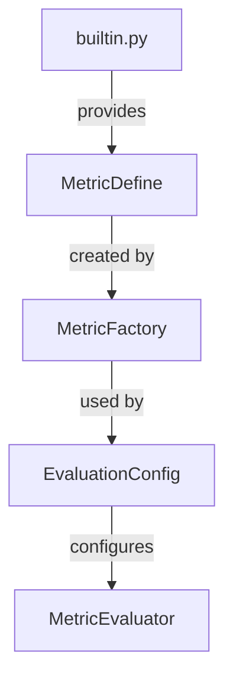

# CLAUDE.md - Development Guidelines for `polars-eval-metrics` Package

This document provides comprehensive guidance for developing and maintaining the `polars-eval-metrics` package, a high-performance model evaluation framework using Polars lazy evaluation.

## Project Overview

**Package Name**: `polars-eval-metrics`  
**Purpose**: A flexible, high-performance framework for evaluating model predictions with support for hierarchical aggregations, custom metrics, and YAML-based configuration.

### Key Features
- **Lazy Evaluation**: Leverages Polars LazyFrame for optimal query planning
- **Flexible Metrics**: Built-in and custom metric definitions
- **YAML Configuration**: Complete evaluation setup via YAML
- **Type Safety**: Pydantic validation throughout
- **Hierarchical Aggregation**: Support for subject/visit level metrics
- **Clear Architecture**: Separation of definition, creation, and evaluation

## Project Structure

```
demo_eval_metric/
+-- plan/                        # [REFERENCE ONLY - DO NOT MODIFY]
|   +-- CLAUDE.md               # Original planning documentation
|   +-- class_diagram.md        # Architecture diagrams
|   +-- polar_expression.md     # Polars expression patterns
|   +-- YAML_PATTERNS.md        # YAML configuration patterns
|   +-- examples.qmd            # Example notebooks
|   +-- evaluation_schema.yaml  # Schema reference
|
+-- src/                         # [PRODUCTION CODE]
|   +-- polars_eval_metrics/
|       +-- __init__.py         # Package exports
|       +-- core/               # Core metric functionality
|       |   +-- __init__.py
|       |   +-- metric_define.py     # MetricDefine class - metric definition
|       |   +-- metric_factory.py    # MetricFactory - creates metrics from YAML
|       |   +-- builtin.py          # Built-in metrics and selectors
|       +-- evaluation/         # Evaluation engine
|       |   +-- __init__.py
|       |   +-- metric_evaluator.py  # MetricEvaluator - executes evaluations
|       |   +-- config.py           # EvaluationConfig - full configuration
|       +-- py.typed            # PEP 561 type hint marker
|
+-- docs/                        # [DOCUMENTATION WEBSITE]
|   +-- _quarto.yml             # Quarto configuration
|   +-- index.qmd               # Homepage
|   +-- quickstart.qmd         # Quick start guide
|   +-- metric.qmd              # MetricDefine examples
|   +-- _site/                  # [GENERATED - git ignored]
|
+-- tests/                       # [TEST SUITE]
|   +-- test_metric_define.py  # Unit tests for MetricDefine
|   +-- test_basic.py.bak       # [BACKUP - to be updated]
|
+-- .github/
|   +-- workflows/
|       +-- docs.yml            # Documentation deployment
|       +-- test.yml            # CI/CD testing pipeline
|
+-- pyproject.toml              # Package configuration
+-- README.md                   # Project README
+-- LICENSE                     # MIT License
+-- CLAUDE.md                   # This file
```

## Core Architecture

### Class Hierarchy and Responsibilities



### 1. **MetricDefine** (`core/metric_define.py`)
**Purpose**: Core metric definition class  
**Responsibilities**:
- Define metric properties (name, label, type, scope)
- Hold aggregation and selection expressions
- Validate metric configuration
- Support both built-in and custom expressions

**Key Features**:
```python
class MetricDefine:
    name: str                           # Metric identifier
    label: str | None                   # Display name
    type: MetricType                    # Aggregation type
    scope: MetricScope | None           # Calculation scope
    agg_expr: list[str | pl.Expr]      # Aggregation expressions
    select_expr: str | pl.Expr         # Selection expression
```

### 2. **MetricFactory** (`core/metric_factory.py`)
**Purpose**: Factory pattern for creating MetricDefine instances  
**Responsibilities**:
- Parse YAML/dict configuration
- Create MetricDefine instances with validation
- Handle legacy configuration formats
- Normalize expressions to proper format

**Key Methods**:
```python
@staticmethod
def from_yaml(config: dict) -> MetricDefine
@staticmethod
def from_dict(config: dict) -> list[MetricDefine]
```

### 3. **EvaluationConfig** (`evaluation/config.py`)
**Purpose**: Complete evaluation configuration container  
**Responsibilities**:
- Hold all evaluation settings
- Parse YAML configuration files
- Use MetricFactory to create metrics
- Provide configuration override capabilities

**Key Attributes**:
```python
ground_truth: str              # Ground truth column
estimates: list[str]           # Model estimate columns
group_by: list[str]           # Grouping columns
metrics: list[MetricDefine]   # Metrics to evaluate
filter_expr: str | None       # Optional filter
```

### 4. **MetricEvaluator** (`evaluation/metric_evaluator.py`)
**Purpose**: Main evaluation engine  
**Responsibilities**:
- Execute metric evaluations on data
- Handle hierarchical aggregations
- Apply filters and grouping
- Return results as Polars DataFrames

### 5. **Built-in Metrics** (`core/builtin.py`)
**Purpose**: Pre-defined metrics and selectors  
**Content**:
- `BUILTIN_METRICS`: Common metrics (mae, rmse, etc.)
- `BUILTIN_SELECTORS`: Aggregation selectors (mean, median, etc.)

## Metric Types and Aggregation Patterns

### MetricType Enum
| Type | Description | LazyFrame Pattern |
|------|-------------|-------------------|
| `ACROSS_SAMPLES` | Aggregate across all samples | `.select(expr)` |
| `WITHIN_SUBJECT` | Aggregate within each subject | `.group_by('subject_id').agg(expr)` |
| `ACROSS_SUBJECT` | Two-level: within then across subjects | `.group_by('subject_id').agg(expr).select(selector)` |
| `WITHIN_VISIT` | Aggregate within each visit | `.group_by(['subject_id', 'visit_id']).agg(expr)` |
| `ACROSS_VISIT` | Two-level: within then across visits | `.group_by(['subject_id', 'visit_id']).agg(expr).select(selector)` |

### MetricScope Enum
| Scope | Description | Usage |
|-------|-------------|-------|
| `GLOBAL` | Calculate once for entire dataset | Overall metrics |
| `MODEL` | Calculate per model only | Model comparison |
| `GROUP` | Calculate per group only | Group analysis |

## Development Workflow

### 1. Setting Up Development Environment
```bash
# Create virtual environment
uv venv
source .venv/bin/activate  # On Windows: .venv\Scripts\activate

# Install package in development mode
uv pip install -e .

# Install test dependencies
uv pip install pytest pytest-cov
```

### 2. Running Tests
```bash
# Run all tests
python -m pytest tests/ -v

# Run specific test file
python -m pytest tests/test_metric_define.py -v

# Run with coverage
python -m pytest tests/ --cov=src/polars_eval_metrics --cov-report=html
```

### 3. Code Quality Checks
```bash
# Format code
black src/ tests/

# Lint code
ruff check src/ tests/

# Type checking (if configured)
mypy src/polars_eval_metrics
```

### 4. Documentation
```bash
# Build documentation locally
cd docs
quarto render

# Preview documentation
quarto preview
```

## API Usage Examples

### Basic Usage
```python
from polars_eval_metrics import MetricDefine, MetricType

# Simple metric
mae = MetricDefine(name="mae")

# Custom metric
pct_accurate = MetricDefine(
    name="pct_within_1",
    label="% Within +/- 1",
    type=MetricType.ACROSS_SAMPLES,
    select_expr=(pl.col('absolute_error') < 1).mean() * 100
)
```

### Hierarchical Metrics
```python
# Two-level aggregation
mae_mean = MetricDefine(
    name="mae:mean",
    type=MetricType.ACROSS_SUBJECT
)
```

### YAML Configuration
```yaml
# evaluation_config.yaml
ground_truth: actual
estimates: [model_1, model_2]
group_by: [treatment_group]

metrics:
  - name: mae
    label: Mean Absolute Error
    
  - name: rmse:median
    label: Median RMSE by Subject
    type: across_subject
```

### Using Factory Pattern
```python
from polars_eval_metrics import MetricFactory, EvaluationConfig

# From YAML dict
metric = MetricFactory.from_yaml({
    'name': 'mae',
    'type': 'across_samples'
})

# Full configuration
config = EvaluationConfig.from_yaml('evaluation_config.yaml')
```

## Testing Strategy

### Current Test Coverage
- [x] **test_metric_define.py**: Comprehensive tests for MetricDefine
  - Basic metric creation
  - Custom expressions
  - Validation rules
  - All metric types and scopes

### Needed Tests
- [ ] MetricFactory tests
- [ ] EvaluationConfig tests
- [ ] MetricEvaluator integration tests
- [ ] End-to-end workflow tests

## GitHub Actions CI/CD

### Test Workflow (`.github/workflows/test.yml`)
- Runs on: Push to main, Pull requests
- Python versions: 3.11, 3.12
- Steps:
  1. Install dependencies
  2. Run pytest
  3. Check code formatting
  4. Run linting

### Documentation Workflow (`.github/workflows/docs.yml`)
- Runs on: Push to main
- Deploys to: GitHub Pages
- Process:
  1. Build Quarto documentation
  2. Deploy to gh-pages branch

## Important Development Notes

### DO's
1. **Use Type Hints**: All functions should have type annotations
2. **Write Tests First**: TDD approach for new features
3. **Follow Factory Pattern**: Use MetricFactory for creating metrics
4. **Validate Early**: Use Pydantic validation in MetricDefine
5. **Document Examples**: Add examples to docs/ for new features
6. **Use ASCII Only**: All code, documentation, and comments must use ASCII characters only

### DON'Ts
1. **Don't Modify plan/**: Reference only, contains original design
2. **Don't Skip Validation**: Always validate user input
3. **Don't Mix Concerns**: Keep metric definition separate from evaluation
4. **Don't Hardcode**: Use configuration for all settings
5. **Don't Break API**: Maintain backward compatibility
6. **Don't Use Unicode**: No emojis, special symbols, or non-ASCII characters

## Common Patterns

### Creating Custom Metrics
```python
# Pattern 1: Simple custom expression
metric = MetricDefine(
    name="custom",
    select_expr=pl.col("error").abs().mean()
)

# Pattern 2: Using built-in with custom selector
metric = MetricDefine(
    name="mae_p90",
    type=MetricType.ACROSS_SUBJECT,
    agg_expr="mae",  # Built-in
    select_expr=pl.col("value").quantile(0.9)  # Custom
)

# Pattern 3: Multiple aggregations
metric = MetricDefine(
    name="weighted",
    type=MetricType.ACROSS_SUBJECT,
    agg_expr=["mae", pl.col("weight").mean().alias("w")],
    select_expr=(pl.col("value") * pl.col("w")).sum() / pl.col("w").sum()
)
```

## Troubleshooting

### Issue: Import errors in tests
**Solution**: Install package in development mode
```bash
uv pip install -e .
```

### Issue: GitHub Actions failing
**Solution**: Check test.yml points to correct directories:
- Tests should run from root: `pytest tests/`
- Coverage should check: `src/polars_eval_metrics`

### Issue: Documentation not building
**Solution**: Ensure all imports in docs use correct paths:
```python
import sys
sys.path.append('../src')
from polars_eval_metrics import MetricDefine
```

## Future Enhancements

### Planned Features
1. **pl_expr() method**: Show LazyFrame chain visualization
2. **Metric Compiler**: Separate expression compilation logic
3. **More built-in metrics**: Expand the metric library
4. **Performance benchmarks**: Add performance testing suite
5. **CLI interface**: Command-line evaluation tool

### Refactoring Opportunities
1. Consider separating MetricCompiler from MetricDefine
2. Add metric registry pattern for built-ins
3. Implement metric composition patterns
4. Add async evaluation support

## Contributing Guidelines

### Pull Request Process
1. Create feature branch from main
2. Write tests for new features
3. Update documentation
4. Ensure all tests pass
5. Update CHANGELOG.md
6. Submit PR with clear description

### Code Review Checklist
- [ ] Tests added/updated
- [ ] Documentation updated
- [ ] Type hints present
- [ ] No breaking changes
- [ ] Follows existing patterns

## Support and Resources

- **Documentation**: Auto-deployed to GitHub Pages
- **Issues**: GitHub Issues for bug reports
- **Discussions**: GitHub Discussions for questions
- **Examples**: See `docs/` directory for usage examples

---

*Last updated: 2024-12-02*  
*Maintainer: Engineering Team*