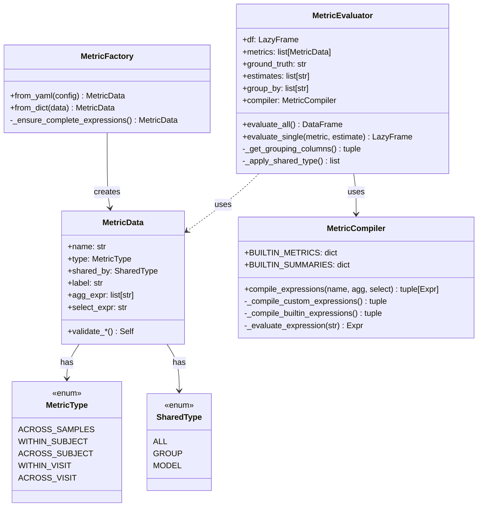
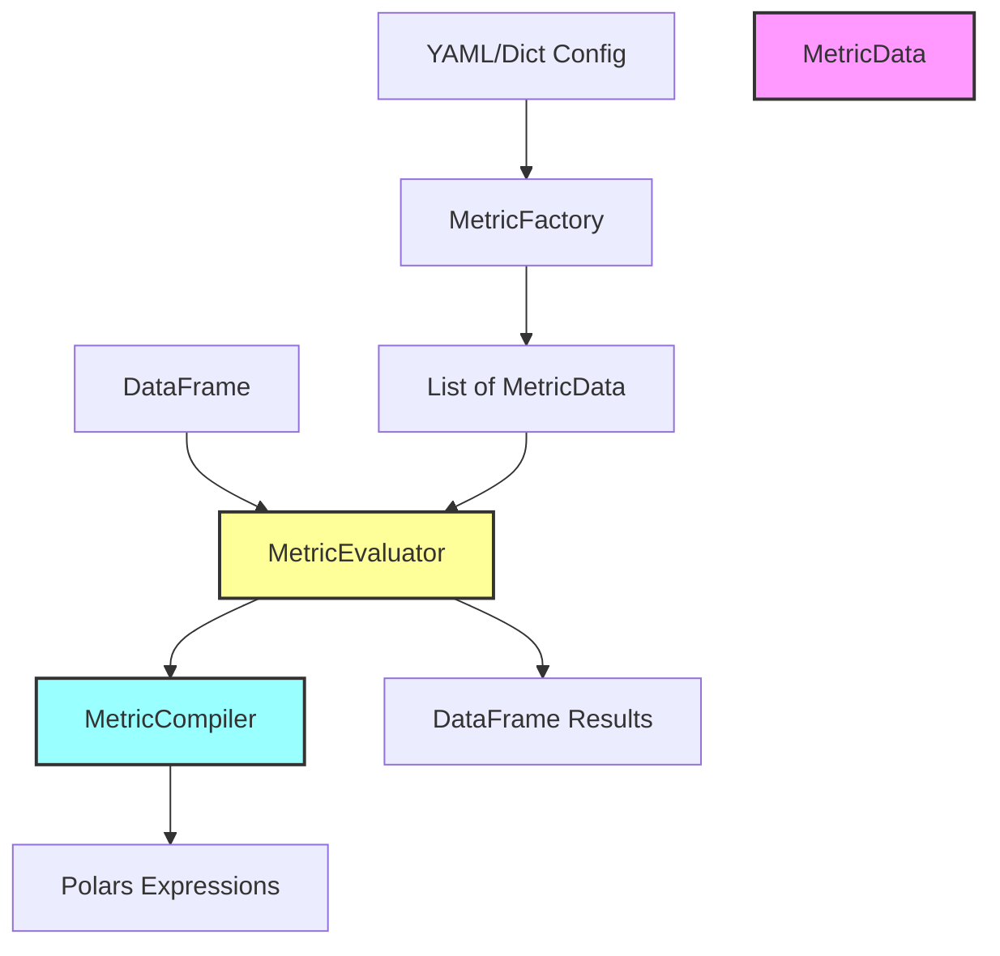

# Class Architecture - Decoupled Design

## Core Class Diagram



## Decoupled Component Flow



## Key Classes

### 1. **MetricEvaluator** (formerly LazyEvaluator)
Core evaluation engine that orchestrates the metric computation pipeline. Stores all context at initialization and handles grouping logic based on MetricType and SharedType.

### 2. **MetricData** (formerly Metric)
Pure data model for metric definitions with structural validation only. No Polars dependencies - just configuration data.

### 3. **MetricFactory** (formerly ConfigParser)
Factory for creating MetricData instances from various sources (YAML, dict). Handles parsing logic and ensures expression completeness.

### 4. **MetricCompiler** (formerly ExpressionCompiler)
Converts metric names and string expressions to Polars expressions. Contains all Polars-specific logic including built-in metrics and summaries.

### 5. **MetricType** (Enum)
Defines aggregation levels for metrics.

### 6. **SharedType** (Enum)
Controls how metrics are shared across models/groups.

## Usage Example

```python
# 1. Parse configuration
metrics = [MetricFactory.from_yaml(cfg) for cfg in config['metrics']]

# 2. Initialize evaluator with compiler
compiler = MetricCompiler()
evaluator = MetricEvaluator(
    df=data,
    metrics=metrics,
    ground_truth="actual",
    estimates=["model1", "model2"],
    group_by=["treatment"],
    compiler=compiler
)

# 3. Evaluate
results = evaluator.evaluate_all()
```

## Design Principles

1. **Single Responsibility**: Each class has one clear purpose
   - MetricData: Configuration and validation
   - MetricCompiler: Expression compilation
   - MetricEvaluator: Pipeline orchestration
   - MetricFactory: Object creation

2. **Dependency Inversion**: High-level modules don't depend on low-level details
   - MetricData doesn't know about Polars
   - MetricEvaluator uses MetricCompiler interface

3. **Open/Closed**: Open for extension, closed for modification
   - Easy to add new metric types or expressions
   - Can swap expression engines without changing core logic

4. **Interface Segregation**: Clean, focused interfaces
   - Each class exposes only necessary methods
   - Private methods handle internal complexity

5. **Lazy Evaluation**: Leverages Polars LazyFrame for performance